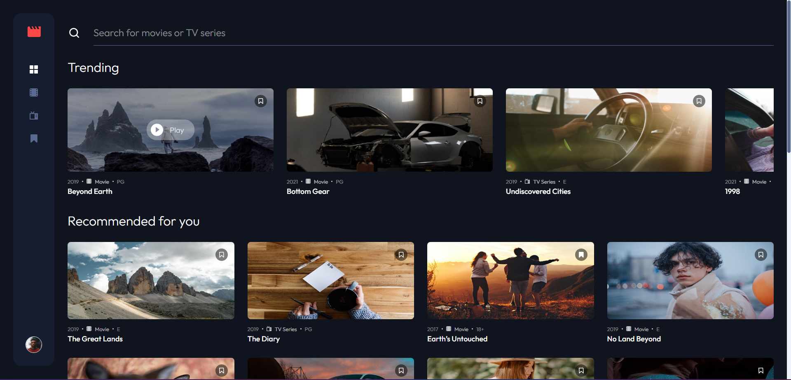

# Description

This app is a showcase for a frontend project, using React, Typescript, react-router-dom and Zustand for state
management.

This project is meant to be a landing page for an Entertainment App, where the user can see a list of Movies or TV Shows
and
search for a specific one by it's name.

The user can also see grouped categories of:
- Movies.
- Tv Series.
- Own Bookmarks.

# Installation
run npm install to install all the dependencies.

# Usage
run npm start to start the app in development mode.

# Enjoy :)